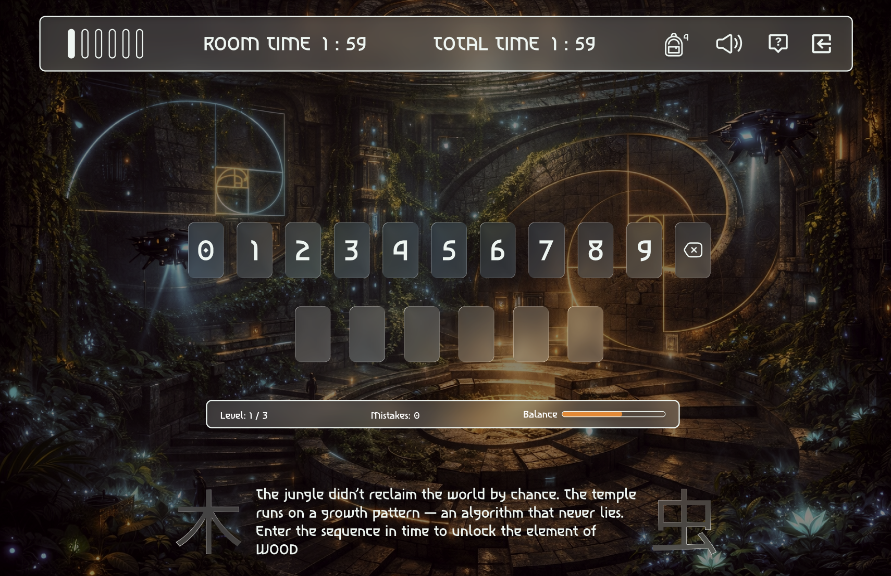

# The Temple of Five
**This repository is presented in my personal GitHub as part of my portfolio. The project itself was developed collaboratively as a school group project during the Front-End Developer program at Medieinstitutet 2026.**

🔗 **[Play The Temple of Five](https://lollolicense.github.io/The-Temple-of-Five/)**

### The Team: The Pogo Stick Pioneers

## Tech Stack

## About the Game

In a future where cities collapsed and the jungle reclaimed the world, one structure still breathes with dormant power. The Temple of Five Elements holds ancient survival tech — sealed behind trials of Wood, Fire, Earth, Metal, and Water.

These are the **Wu Xing**, the Five Phases: not just elements, but forces in motion — growth, transformation, stability, structure, and flow. To restore balance, you must pass each chamber and retrieve the tool bound to its phase.

But the temple does not reward effort alone. It rewards timing. Move too slowly, and a mechanism misaligns. A seal cracks. An element returns imperfect.

Collect the true five, complete the cycle, and the final altar will open. Fail, and the temple will send you back to the chamber that broke the balance.

**Restore the balance — or leave with nothing.**

### **Core Features**

- **Five Elemental Trials:** Five distinct chambers, each shaped by one of the Wu Xing phases — Wood, Fire, Earth, Metal, and Water.
- **Immersive Atmosphere:** Dynamic audio, custom CSS animations, and thematic visual effects.
- **Real-time Scoring:** Progress tracking with a highscore system based on speed and accuracy.
- **Full Accessibility:** Designed for both mouse and keyboard navigation (ARIA-compliant).
- **Responsive Design:** Optimized for various screen sizes, from desktop to mobile.

## My Contribution

My role in the project focused on both visual direction and front-end development.

- creating the visual concept and design direction in **Figma**
- building the **style tile**, components, and interface structure
- shaping the game’s **story concept**, atmosphere, and generated visuals
- developing the **Wood chamber**
- implementing the **login flow**
- building the **Game Over** and **Game Win** views
- contributing to UI polish, structure, and overall front-end experience

### Wood Chamber

The chamber is a number-sequence challenge built around the Fibonacci sequence, chosen because of its strong connection to growth patterns in nature. Since the Wood chamber represents growth, life, and organic balance, the Fibonacci sequence supports the room’s theme in both concept and gameplay.

## Design & Planning

The visual concept for **The Temple of Five** was created by me in **Figma**, where I developed the style tile, interface direction, component thinking, and the game’s overall visual structure. I also shaped the project’s narrative tone and atmospheric identity.

- **Logic & Flow:** [Miro Flowchart](https://miro.com/app/board/uXjVGD_af74=/?share_link_id=396365481063)
- **Visual Identity & Mockup:** [Figma Prototype](https://www.figma.com/proto/OJgqdjOM1fksuh2Gh2rsAX/The-temple-of-five?node-id=4-55&p=f&t=QRSCgQpighrHxX8w-0&scaling=scale-down&content-scaling=fixed&page-id=0%3A1&device-frame=0)

## How to Play

1.  **Enter the Temple:** Begin your adventure in the first elemental chamber.
2.  **Solve to Advance:** Read the room’s unique instructions, interact with the environment, and complete the chamber’s challenge to claim the artifact.
3.  **Master the Elements:** Progress through all five rooms, adapting to different mechanics in each.
4.  **The Final Challenge:** Complete the final trial to see your total score and escape the temple!

---

### Audio & Sound Effects (via Pixabay)

| Room      | Music                                                                                                             | Sound Effects                                                                                                                                                                                                                                                                                                              |
| --------- | ----------------------------------------------------------------------------------------------------------------- | -------------------------------------------------------------------------------------------------------------------------------------------------------------------------------------------------------------------------------------------------------------------------------------------------------------------------- |
| **Wood**  | _Shadowed Whispers_ – [TrenoX8](https://pixabay.com/music/mystery-shadowed-whispers-321103/)                      | Click – [arunangshubanerjee](https://pixabay.com/sound-effects/film-special-effects-cassette-recorder-stop-button-mechanical-click-sound-359987/)                                                                                                                                                                          |
| **Fire**  | _Ambient Burning Castle_ – [Sound Reality](https://pixabay.com/music/ambient-ambient-burning-castle-320841/)      | —                                                                                                                                                                                                                                                                                                                          |
| **Earth** | _Abyssal Echoes_ – [TrenoX8](https://pixabay.com/music/mystery-abyssal-echoes-dark-cinematic-suspenseful-316857/) | Click – [arunangshubanerjee](https://pixabay.com/sound-effects/film-special-effects-cassette-recorder-stop-button-mechanical-click-sound-359987/)   Stone Slide – [u_i15wxund59](https://pixabay.com/sound-effects/film-special-effects-stone-slide-sound-effects-322794/)                                              |
| **Metal** | _Veil of Darkness_ – [TrenoX8](https://pixabay.com/music/mystery-veil-of-darkness-321167/)                        | Click – [arunangshubanerjee](https://pixabay.com/sound-effects/film-special-effects-cassette-recorder-stop-button-mechanical-click-sound-359987/)                                                                                                                                                                          |
| **Water** | _The Cave_ – [Andrea Good](https://pixabay.com/music/ambient-the-cave-220274/)                                    | —                                                                                                                                                                                                                                                                                                                          |
| **Final** | _Cursed Forest_ – [TrenoX8](https://pixabay.com/music/mystery-cursed-forest-305207/)                              | Click – [arunangshubanerjee](https://pixabay.com/sound-effects/film-special-effects-cassette-recorder-stop-button-mechanical-click-sound-359987/)   _Submority Boom_ – [SUBMORITY](https://pixabay.com/users/submority-30821389/?utm_source=link-attribution&utm_medium=referral&utm_campaign=music&utm_content=123876) |

---

#### Thanks for visiting this little temple 
