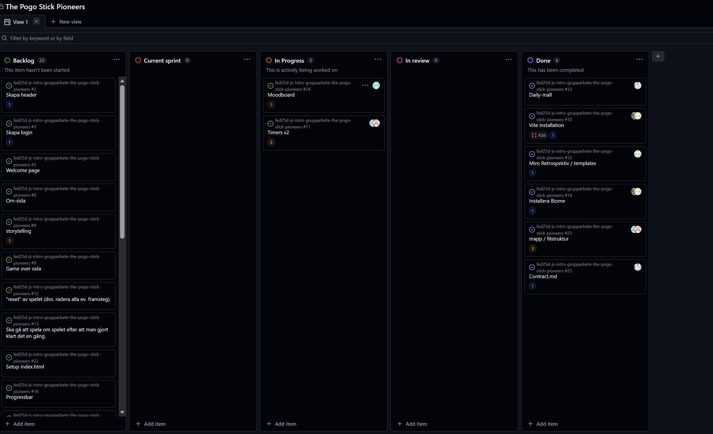

# Daily Standup: veckodag 2026-02-16

Miro: <a>https://miro.com/app/board/uXjVGD_af74=/?share_link_id=396365481063</a>

---

Dagens scrum master: Alexander Johansson 🧑‍🌾

## Emil
- **Idag har jag**: Inget än, i fredags gjorde klart budgetappen.
- **Dagens mål**: Få fler uppgifter att jobba med
- **Ett problem jag har**: Nej
- **Jag behöver hjälp med**: Nej
- **Idag har jag lärt mig**: Nej inte än, men ser framemot 

## Minai
- **Idag har jag**: Ingenting än, under helgen gjorde jag en moodboard
- **Dagens mål**: Lära mig mer av Git 
- **Ett problem jag har**: Inte just nu
- **Jag behöver hjälp med**: Nej inte för tillfället
- **Idag har jag lärt mig**: Nej.
  
## Louise
- **Idag har jag**: Jag har satt mig in i gruppuppgiften - samt sammansltällt min moodboard
- **Dagens mål**: Sätta tema, design och storyline så vi har något att jobba på
- **Ett problem jag har**: Nej.
- **Jag behöver hjälp med**: Nej inte just nu.
- **Idag har jag lärt mig**: Hot reload - genom API.

## Alexandra
- **Idag har jag**: Jag har gjort klart budgetappen i fredags, spånat med moodboard i helgen. 
- **Dagens mål**: Sätta design, tema och storyline.
- **Ett problem jag har**: Nej
- **Jag behöver hjälp med**: Nej inte just nu
- **Idag har jag lärt mig**: Inget än

## Alex
- **Idag har jag**: Gjorde klart budgetappen - försökt komma fram till globala regler för gruppuppgiften
- **Dagens mål**: Sätta design, tema och storyline.
- **Ett problem jag har**: Inget just nu
- **Jag behöver hjälp med**: Nej inte just nu
- **Idag har jag lärt mig**: Göra bättre README

---

### Övrigt: 

Frånvarande: 
Ingen
