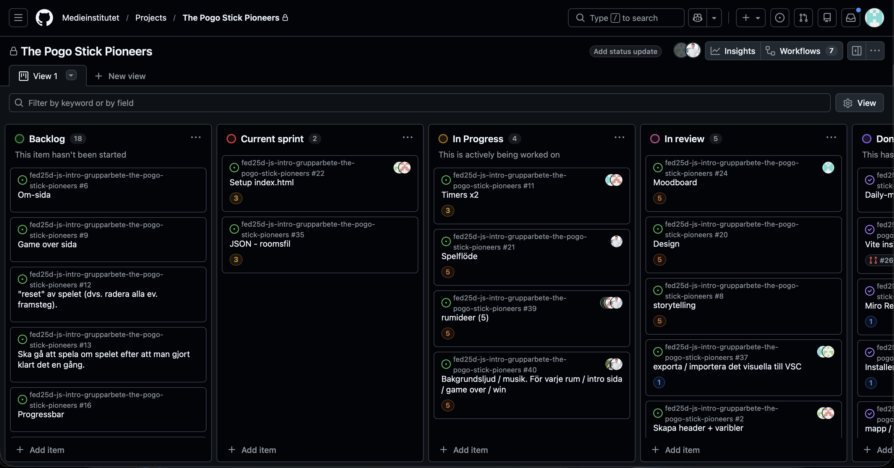

# Daily Standup: veckodag 2026-02-18

Miro: <a>https://miro.com/app/board/uXjVGD_af74=/?share_link_id=396365481063</a>

---

Dagens scrum master: Alexandra Henriksson 🧙‍♀️

## Emil
- **Idag har jag**: Börjat skapa JSON fil och implentera den.
- **Dagens mål**: Få saker färdigt 
- **Ett problem jag har**: Tror jag skrivit fel adress för bakgrunden
- **Jag behöver hjälp med**: Nej
- **Idag har jag lärt mig**: Inget speciellt idag

## Minai
- **Idag har jag**: 
- **Dagens mål**: 
- **Ett problem jag har**: 
- **Jag behöver hjälp med**: 
- **Idag har jag lärt mig**:
  
## Louise
- **Idag har jag**: Tillsammans med emil strukturera om HTML, för att kunna börja med JSON. About sektionen. Fixade png till glasikoner igår.
- **Dagens mål**: Göra färdigt ovanstående
- **Ett problem jag har**: Nej
- **Jag behöver hjälp med**: Nej inte just nu.
- **Idag har jag lärt mig**: Att man kan göra saker på VÄLDIGT många olika sätt

## Alexandra
- **Idag har jag**: Spånat idéer för rummet 
- **Dagens mål**: Fixa mockup i figma för rum visa gruppen
- **Ett problem jag har**: Få ordning på hur logiken för rummet ska vara tillsammans med globala regler
- **Jag behöver hjälp med**: Nej inte just nu 
- **Idag har jag lärt mig**: Att man kan göra saker på VÄLDIGT många olika sätt

## Alex
- **Idag har jag**: Satt med sitt rum, fixade struktur och idé. Flowchart
- **Dagens mål**: Få färdigt flowchart för veckan
- **Ett problem jag har**: Inget direkt
- **Jag behöver hjälp med**: Behöver inte hjälp
- **Idag har jag lärt mig**: Audio filer

---

### Övrigt: 

Frånvarande: 
Minai är sjuk och hennes katt avled
