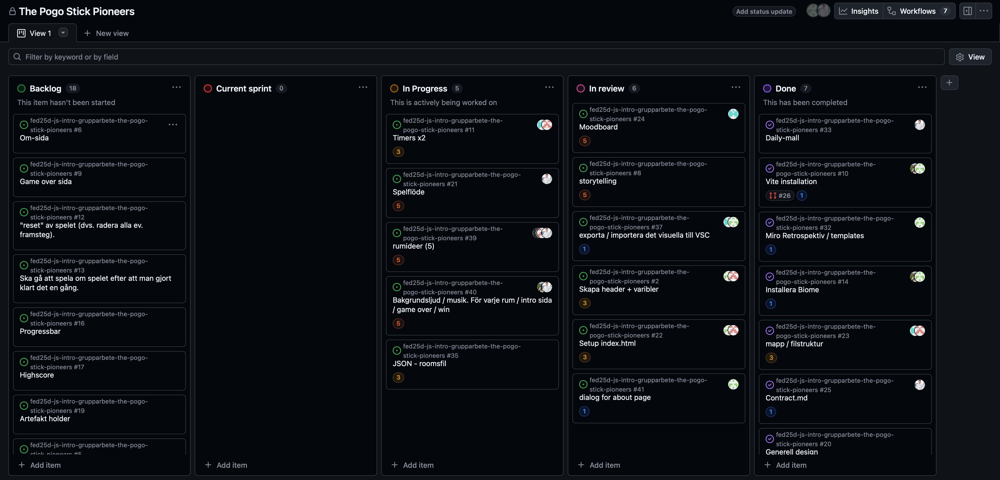

# Daily Standup: veckodag 2026-02-19

Miro: <a>https://miro.com/app/board/uXjVGD_af74=/?share_link_id=396365481063</a>

---

Dagens scrum master: Alexandra Henriksson 🧙‍♀️

## Emil
- **Idag har jag**: Har haft föreläsning
- **Dagens mål**:  Fixa funktionalliten på menyn så det funkar
- **Ett problem jag har**: Koden försvann
- **Jag behöver hjälp med**: Nej
- **Idag har jag lärt mig**: Allt är inte guld och gröna skogar på arbetsmarknaden

## Minai
- **Idag har jag**: Har haft föreläsning, kommit på idé till rummet
- **Dagens mål**: Göra något i rummet
- **Ett problem jag har**: Behöver ha hjälp med rummet och lite med bransch/merges
- **Jag behöver hjälp med**: Ovanstående
- **Idag har jag lärt mig**: Inte något speciellt
  
## Louise
- **Idag har jag**: Har haft föreläsning. Gjort dialog om about, mixin till buttons
- **Dagens mål**: Kanske börja lite med rummet
- **Ett problem jag har**: Nej
- **Jag behöver hjälp med**: Nej inte just nu
- **Idag har jag lärt mig**: Allt är inte guld och gröna skogar på arbetsmarknaden

## Alexandra
- **Idag har jag**: Har haft föreläsning, spånat idéer för rummet, gjort en mockup i figma för att visuellt se hur rummet ska vara
- **Dagens mål**: Fixa dropdown meny till headern
- **Ett problem jag har**: Inget just nu
- **Jag behöver hjälp med**: Nej inte just nu 
- **Idag har jag lärt mig**: Allt är inte guld och gröna skogar på arbetsmarknaden

## Alex
- **Idag har jag**: Fixat med audiofiler, 
- **Dagens mål**: Fixa färdigt audiofiler, göra mockup till rummet
- **Ett problem jag har**: Inget direkt, lite fel i ts-filen
- **Jag behöver hjälp med**: Figma 
- **Idag har jag lärt mig**: Allt är inte guld och gröna skogar på arbetsmarknaden

---

### Övrigt: 

Frånvarande: 

