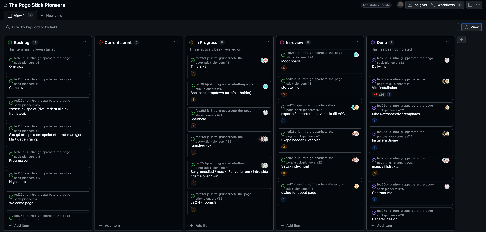

# Daily Standup: veckodag 2026-02-20

Miro: <a>https://miro.com/app/board/uXjVGD_af74=/?share_link_id=396365481063</a>

---

Dagens scrum master: Alexandra Henriksson 🧙‍♀️

## Emil
- **Idag har jag**: undersökt ideer till mitt rum
- **Dagens mål**: är att jag ska ha ett färdigt koncept tills på måndag
- **Ett problem jag har**: Inget just nu
- **Jag behöver hjälp med**: nej
- **Idag har jag lärt mig**: att det tar lite tid att komma fram till något

## Minai
- **Idag har jag**: Igår jobbade på designen på mitt rum i Figma, idag har jag inte hunnit göra så mycket än
- **Dagens mål**: Göra något i rummet då designen är snart klar
- **Ett problem jag har**: Behöver ha hjälp med rummet och lite med bransch/merges
- **Jag behöver hjälp med**: Ovanstående
- **Idag har jag lärt mig**: Att Figma är väldigt coolt men väldigt komplicerat. Måste kolla på lite tutorials på YT
försökte ge i md form men discord använder samma format.
  
## Louise
- **Idag har jag**: Suttit i min testmiljö och kodat min testmiljö för wood room, visat Minai lite figma basics, kollar och rättat min feedback från budgetappen och forkat den till egent repo
- **Dagens mål**: Avsluta i tid
- **Ett problem jag har**: Att stänga igen datorn
- **Jag behöver hjälp med**: Nej inte just nu
- **Idag har jag lärt mig**: vad Math.sin betyder

## Alexandra
- **Idag har jag**: Har jobbat med headerns dropdown för artifakterna
- **Dagens mål**: Fixa problemet med mixins och kolla mer konkreta flöden för rummet
- **Ett problem jag har**: Mixins
- **Jag behöver hjälp med**: Nej inte just nu 
- **Idag har jag lärt mig**: Att det är bra att ta hjälp av kollegorna när det behövs och inte vara rädd för att fråga

## Alex
- **Idag har jag**: satt ljudfunktionen, och skrivit guide om denna. Ps. Testa fire room och sätt på ljudet 
- **Dagens mål**: Inget specifikt förutom att ta hand om syskon och alla nära med tanke på urnsättningen. Däremot kommer jag sitta lite i helgen och nörda in mig i figma
- **Ett problem jag har**: Jag har inga problem just nu. Förutom att jag vill bli lära mig figma
- **Jag behöver hjälp med**: Figma 
- **Idag har jag lärt mig**: Ett väldigt bra sätt för teamet att kolla så vi inte få mergekonflikter innan vi pushar main. Jag visar detta senare

---

### Övrigt: 

Frånvarande: 

