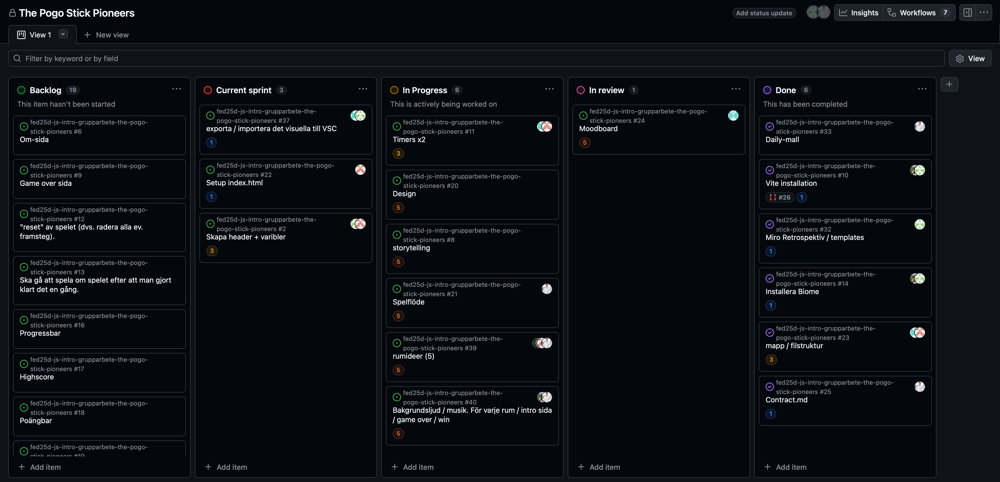

# Daily Standup: veckodag 2026-02-17

Miro: <a>https://miro.com/app/board/uXjVGD_af74=/?share_link_id=396365481063</a>

---

Dagens scrum master: Alexandra Henriksson 🧙‍♀️

## Emil
- **Idag har jag**: Mockup av headern och sedan jobbat med headern tillsammans med Louise
- **Dagens mål**: Jobba på togglefunktion
- **Ett problem jag har**: Mixins, för att få bakgrundsstyling
- **Jag behöver hjälp med**: Nej
- **Idag har jag lärt mig**: Att mixins är inte så straightforward

## Minai
- **Idag har jag**: 
- **Dagens mål**: 
- **Ett problem jag har**: 
- **Jag behöver hjälp med**: 
- **Idag har jag lärt mig**:
  
## Louise
- **Idag har jag**: Jobbat med headern tillsammans med Emil, lagt in fonter, progressbar visuellt
- **Dagens mål**: Mixins
- **Ett problem jag har**: Vill lösa mixins problematiken, göra om glasikonerna
- **Jag behöver hjälp med**: Nej inte just nu.
- **Idag har jag lärt mig**: Samarbeta med push och pull

## Alexandra
- **Idag har jag**: Spånat idéer för rummen
- **Dagens mål**: Lösa glaseffekt problematiken annars får vi skippa den idéen
- **Ett problem jag har**: glaseffekten
- **Jag behöver hjälp med**: Nej inte just nu men jag och louise hjälper varandra
- **Idag har jag lärt mig**: Det kan vara svårt med sass för att följa trender

## Alex
- **Idag har jag**: Spånat idéer för rummen och lagt in i miro. Forskat på ljudfiler till spelet och kollat vad man ska ha för a11y
- **Dagens mål**: Få idéen att funka design och funktionsmässigt
- **Ett problem jag har**: Inget direkt
- **Jag behöver hjälp med**: Behöver inte hjälp
- **Idag har jag lärt mig**: Inget just nu

---

### Övrigt: 

Frånvarande: 
Minai är sjuk och fick lämna katten på akuten också
