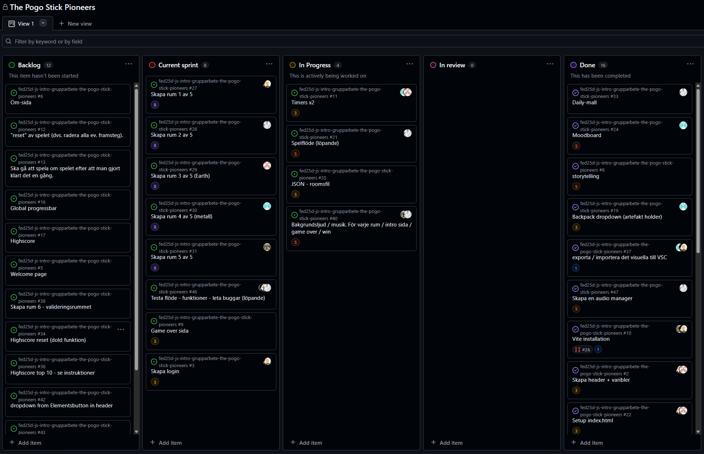

# Daily Standup: veckodag 2026-02-23

Miro: <a>https://miro.com/app/board/uXjVGD_af74=/?share_link_id=396365481063</a>

---

Dagens scrum master: Minai Karlsson 👩‍🚀

## Emil

- **Idag har jag**: Sprintplanering & backlogg.
- **Dagens mål**: Timers, och Rum
- **Ett problem jag har**: Gemini bildgenerering strular
- **Jag behöver hjälp med**: Nej
- **Idag har jag lärt mig**: Inte så lätta att få AI att göra saker.

## Minai

- **Idag har jag**: Sprintplanering & backlogg.
- **Dagens mål**: Lokalt testrum & TypeScript-konfiguration.
- **Ett problem jag har**: Osäkerhet kring Git-flödet (rädd för merge-conflicts).
- **Jag behöver hjälp med**: Genomgång av branches och commits.
- **Idag har jag lärt mig**: Nej

## Louise

- **Idag har jag**: Sprintplanering & HTML-struktur för rum (från testmiljö).
- **Dagens mål**: Lokalt testrum & TypeScript-konfiguration.
- **Ett problem jag har**: Nej
- **Jag behöver hjälp med**: Nej
- **Idag har jag lärt mig**: Fördelar med att anropa specifika sektioner framför querySelector.

## Alexandra

- **Idag har jag**: Sprintplanering & backlogg.
- **Dagens mål**: Påbörja kod för rummet.
- **Ett problem jag har**: Nej
- **Jag behöver hjälp med**: Nej
- **Idag har jag lärt mig**: Nej

## Alex

- **Idag har jag**: Sprintplanering & backlogg.
- **Dagens mål**: Figma & påbörja rum/audio
- **Ett problem jag har**: Har problem Figma
- **Jag behöver hjälp med**: Behöver hjälp med Figma
- **Idag har jag lärt mig**: Fördjupning i Figma

---

### Hjälpbehov

Minai: Hjälpa Minai med branch-strategi.

Alex: Behöver support i Figma.

### Övrigt:

Frånvarande:
Ingen
