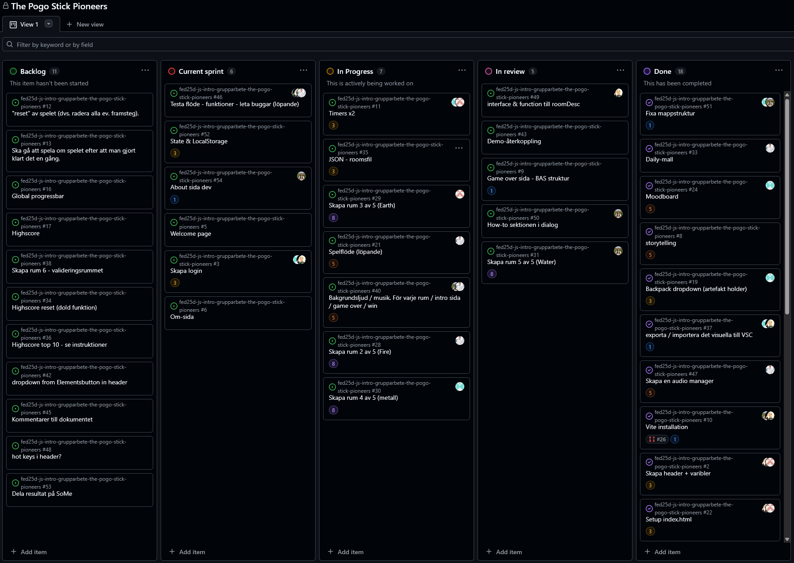

# Daily Standup: veckodag 2026-02-26

Miro: <a>https://miro.com/app/board/uXjVGD_af74=/?share_link_id=396365481063</a>

---

Dagens scrum master: Minai Karlsson 👩‍🚀

## Emil

- **Idag har jag**: Varit med på demo. Fortsatt med den grafiska profilen/designen för mitt rum.
- **Dagens mål**: Bli så klar som möjligt med det grafiska så jag kan börja med kodningen.
- **Ett problem jag har**: Problem med Photoshop.
- **Jag behöver hjälp med**: Ingen hjälp behövs
- **Idag har jag lärt mig**: Glömt bort hur Photoshop fungerar.

## Minai

- **Idag har jag**: Varit med på demo.
- **Dagens mål**: Läsa på vad "About Dev" ska innehålla (detaljer, struktur etc.). Fixa Responsive i mitt rum.
- **Ett problem jag har**: Inga problem.
- **Jag behöver hjälp med**: Ingen hjälp behövs.
- **Idag har jag lärt mig**: Nej

## Louise

- **Idag har jag**: Varit med på demo.
- **Dagens mål**: Påbörja arbetet med inloggningen.
- **Ett problem jag har**: Tålamodet prövas när jag ska sätta mig in i det logiska flödet.
- **Jag behöver hjälp med**: Ingen hjälp behövs.
- **Idag har jag lärt mig**: Att det finns väldigt många duktiga personer och roliga projekt i den här utbildningen.

## Alexandra

- **Idag har jag**: Presenterat på demon.
- **Dagens mål**: Fortsätta med rummet och bli helt klar med det under veckan.
- **Ett problem jag har**: Att få till ett bra logiskt flöde i tanken.
- **Jag behöver hjälp med**: Inga problem som kräver hjälp just nu.
- **Idag har jag lärt mig**: Att tänka mer i flöden. Ser mer logik i koden idag och kan läsa den på ett bättre sätt.

## Alex

- **Idag har jag**: Varit med på demo. Suttit med rummet och gjort klart all styling.
- **Dagens mål**: Arbeta vidare med TypeScript.
- **Ett problem jag har**: Inga problem.
- **Jag behöver hjälp med**: Ingen hjälp behövs.
- **Idag har jag lärt mig**: Att tänka mer i flöden. Ser mer logik i koden idag och kan läsa den på ett bättre sätt.

---

### Övrigt:

Frånvarande:
Ingen
