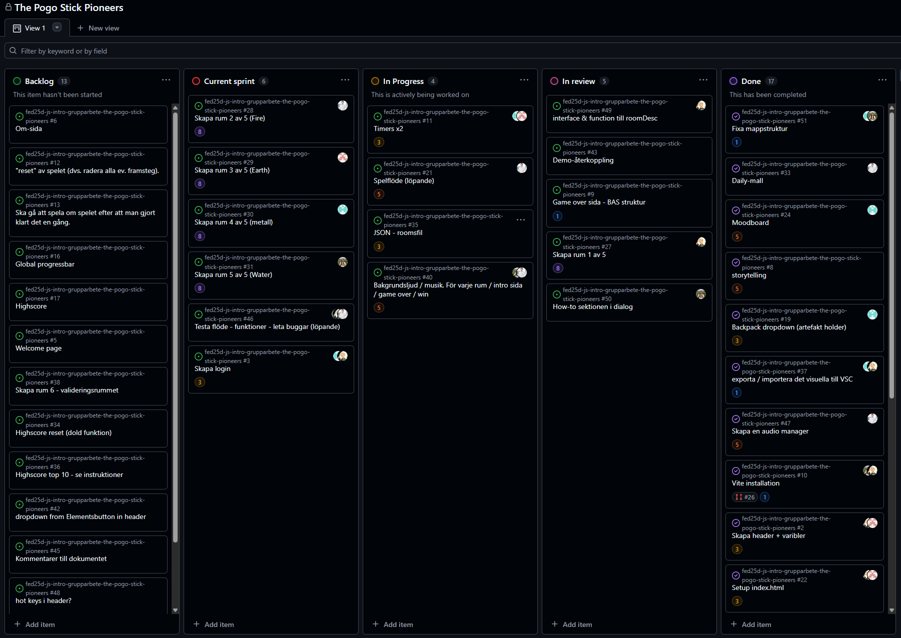

# Daily Standup: veckodag 2026-02-25

Miro: <a>https://miro.com/app/board/uXjVGD_af74=/?share_link_id=396365481063</a>

---

Dagens scrum master: Minai Karlsson 👩‍🚀

## Emil

- **Idag har jag**:
- **Dagens mål**:
- **Ett problem jag har**:
- **Jag behöver hjälp med**:
- **Idag har jag lärt mig**:

## Minai

- **Idag har jag**: Gjort klart "How to"-delen och döpt om den till controllers
- **Dagens mål**: Göra om mappstrukturen
- **Ett problem jag har**: Inga problem
- **Jag behöver hjälp med**: Ingen hjälp behövs
- **Idag har jag lärt mig**: Att konflikter är komplicerade men att det går att lösa om man samarbetar

## Louise

- **Idag har jag**: Lagt in musik i Game Over-rummet, skapat en animation i mitt rum och suttit med Alex för att hantera merge-konflikter
- **Dagens mål**: Prova att lägga en grid i controls och börja göra om min portfolio.
- **Ett problem jag har**: Inga just nu, men vill inte röra för mycket i koden då mappstrukturen ska ändras
- **Jag behöver hjälp med**: Ingen hjälp behövs
- **Idag har jag lärt mig**: Hur man får till en animation med TypeScript och SCSS

## Alexandra

- **Idag har jag**:Jobbat med rummet. (Fick även lägga tid på att uppdatera en app åt en chef)
- **Dagens mål**: Fortsätta med rummet och påbörja mappstrukturen
- **Ett problem jag har**: Inga problem
- **Jag behöver hjälp med**: Inget jag behöver hjälp med
- **Idag har jag lärt mig**: Att chefer inte alltid respekterar tjänstledighet

## Alex

- **Idag har jag**: Gjort klart index-strukturen och stylingen. Har suttit mycket med merge-konflikter (främst åt Alle och Lollo)
- **Dagens mål**: Börja testa vissa TypeScript-funktioner och rendera mina inputs
- **Ett problem jag har**: Inga problem just nu
- **Jag behöver hjälp med**: Ingen hjälp behövs
- **Idag har jag lärt mig**: Mer om merge-konflikter – man lär sig något nytt varje gång

---

### Övrigt:

Frånvarande:
Ingen
