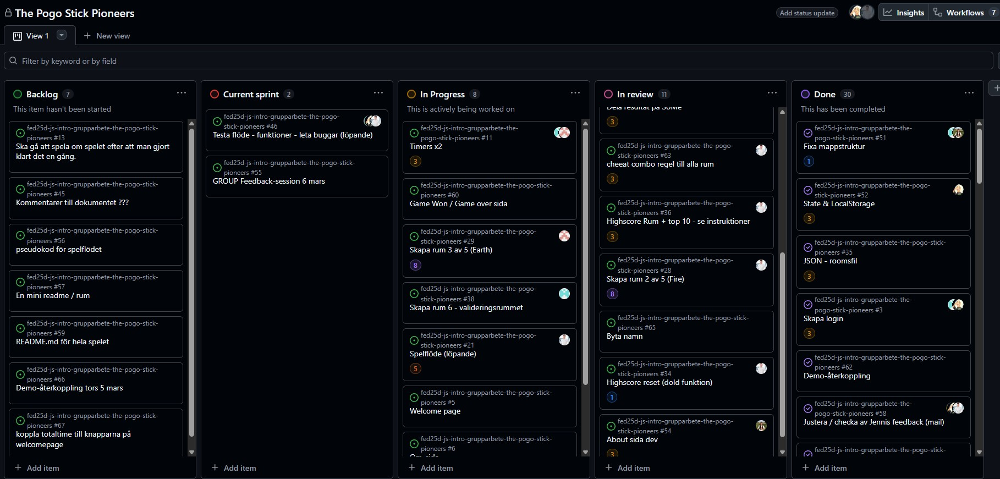

# Daily Standup: veckodag 2026-03-09

Miro: <a>https://miro.com/app/board/uXjVGD_af74=/?share_link_id=396365481063</a>

---

Dagens scrum master: 🦸‍♂️ Emil Lychnell

## Emil

- **Idag har jag**: Inte hunnit med så mycket, Mest möten.
- **Dagens mål**: Timer funktionen för totala tiden ska bli klar och spara resultat locally baserat på användarnamn + mistakes räkning och trangentbords funktionalitet i earth room
- **Ett problem jag har**: Är att jag också måste hinna med dokumentationen denna vecka
- **Jag behöver hjälp med**: Inget just nu
- **Idag har jag lärt mig**: Inget just nu.

## Minai

- **Idag har jag**: Fyllde i retro dokumentation.
- **Dagens mål**: Sätta sig med Alex och fixa highscore (poängräkningen), Texten i about sidan
- **Ett problem jag har**: Inga problem nu
- **Jag behöver hjälp med**: Inget just nu
- **Idag har jag lärt mig**: Inget än

## Louise

- **Idag har jag**: Stabil transition retron,start av validation room med Alle
- **Dagens mål**: På riktigt komma igång med game over rummet och att kunna spela failade rum igen.
- **Ett problem jag har**: Ingen just nu, kanske att vi kommer att behöva ändra i transitions igen senare.
- **Jag behöver hjälp med**: Inget just nu
- **Idag har jag lärt mig**: Inget än

## Alexandra

- **Idag har jag**: Validation room nästan färdigt. Styling är kvar.
- **Dagens mål**: Styling för validation rummet.
- **Ett problem jag har**: inga problem nu.
- **Jag behöver hjälp med**: inget nu
- **Idag har jag lärt mig**: inget än

## Alex

- **Idag har jag**: Reset funktion för highscore funkar nu, Löst en Dev tools transitions bug (var fel id tack Alle)
- **Dagens mål**: Highscore funktionen (poängräkning)
- **Ett problem jag har**: lite småfix i Fire rummet
- **Jag behöver hjälp med**: Inget hjälp just nu
- **Idag har jag lärt mig**: Kul att göra reset funktioner (Kul med hemligheter)

---

### Övrigt:

Frånvarande: Ingen
