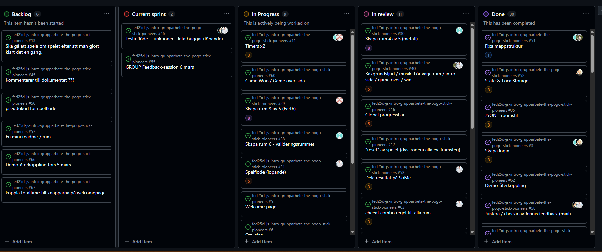

# Daily Standup: veckodag 2026-02-19

Miro: <a>https://miro.com/app/board/uXjVGD_af74=/?share_link_id=396365481063</a>

---

Dagens scrum master: 🦸‍♂️ Emil Lychnell

## Emil

- **Idag har jag**: Har gjort mistakes (moves) räkning samt tangentbords stöd för piltangenterna i earth room.
- **Dagens mål**: skriva om tangentsbords stödet i about sidan. Göra om wood knappen till start game och skapa en continue game knapp kopplad till progress barens kod.
- **Ett problem jag har**: inga problem just nu
- **Jag behöver hjälp med**: ingen hjälp just nu
- **Idag har jag lärt mig**: inget än

## Minai

- **Idag har jag**: Alex highscore grejen poäng räkning
- **Dagens mål**: uppdatera readme filen för hela projektet
- **Ett problem jag har**: inga problem just nu
- **Jag behöver hjälp med**: ingen hjälp just nu
- **Idag har jag lärt mig**: inget än

## Louise

- **Idag har jag**: komma igång med gameover sidan bra flöde för repeat spel, Lagt till ett ljud i wood rummet.
- **Dagens mål**: implementera rätt flöde på samtliga rum.
- **Ett problem jag har**: inga problem just nu
- **Jag behöver hjälp med**: ingen hjälp just nu
- **Idag har jag lärt mig**: När man har ett flöde så är det mycket som ligger i bakgrunden och måste avslutats

## Alexandra

- **Idag har jag**: Efter jobbet felsökte ljudproblemet i valideringsrummet. (ljudet stängs inte av i något rum), Stylade om valideringsrummet så att det skiljer sig från metall rummet.
- **Dagens mål**: Fixa i gameover rummet så att man kan hoppa tillbaka och spela
- **Ett problem jag har**: inga problem just nu
- **Jag behöver hjälp med**: ingen hjälp just nu
- **Idag har jag lärt mig**: funktioner måste avslutas och kallas på rätt sätt och det krävs timing

## Alex

- **Idag har jag**: Highscore med Minai, 1500 max poäng per rum bonus vid totaltid under en viss tid.
- **Dagens mål**: Smågrejer som ska fixas, svg filer, Koppla progressbar till cheat panel.
- **Ett problem jag har**: Knappen som ska kopplas till highscore
- **Jag behöver hjälp med**: ingen hjälp just nu
- **Idag har jag lärt mig**: beräkning av highscore

---

### Övrigt:

Frånvarande:
