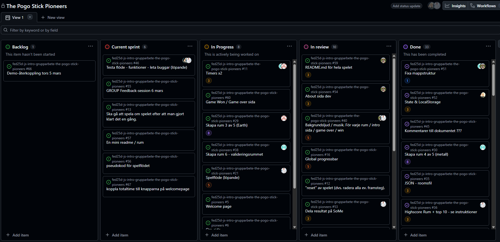

# Daily Standup: veckodag 2026-02-19

Miro: <a>https://miro.com/app/board/uXjVGD_af74=/?share_link_id=396365481063</a>

---

Dagens scrum master: 🦸‍♂️ Emil Lychnell

## Emil

- **Idag har jag**: Gjort klart tangentbords funktionalitet i earth room + löst en bugg med den funktionen
- **Dagens mål**: Få new game och Continue funktionen att fungera fullt ut.
- **Ett problem jag har**: Inget just nu
- **Jag behöver hjälp med**: Inget just nu
- **Idag har jag lärt mig**: Att det blir lite stressigt på slutet av en projekt

## Minai

- **Idag har jag**: Fixat med readme filen för projektet
- **Dagens mål**: Fortsätta med readme, Kolla igenom kommentarer och ändra från svenska till engelska
- **Ett problem jag har**: Inga problem just nu.
- **Jag behöver hjälp med**: Inget just nu.
- **Idag har jag lärt mig**: Inget än.

## Louise

- **Idag har jag**: Samma som Alle försökt få game over flödet att fungera, Fibblar lite med timers för att koppla på rätt vid reset. Ändrat lite styling i about dialog.
- **Dagens mål**: Få flödet att sitta 100% bugg tester av flödet mellan dom olika rummen. Screen block för mobile via CSS
- **Ett problem jag har**: Lite trött idag annars inget.
- **Jag behöver hjälp med**: Inget just nu
- **Idag har jag lärt mig**: Man har verkligen lärt sig hur man borde ha gjort från första början.

## Alexandra

- **Idag har jag**: Jag och Lollo har felsökt diverse buggar. Felsökning i validerings rummet. Gjort klart game over rummet
- **Dagens mål**: Fortsatt felsökning i validerings rummet, Game over rummet.
- **Ett problem jag har**: Inget just nu
- **Jag behöver hjälp med**: inget just nu
- **Idag har jag lärt mig**: Att det blir stressigt

## Alex

- **Idag har jag**: Gjorde klart highscore funktionen kopplat knappar, Readme för highscore och fire rummet, Ändrade i SVG i fire room.
- **Dagens mål**: Koppla på highscore funktionen
- **Ett problem jag har**: inget problem just nu
- **Jag behöver hjälp med**: ingen hjälp
- **Idag har jag lärt mig**: Stressande i slutet.

---

### Övrigt:

Frånvarande:
