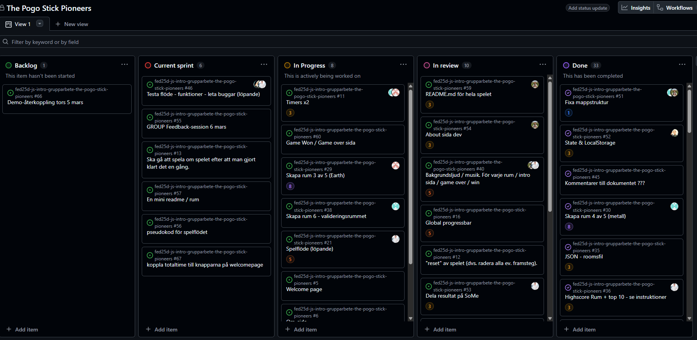

# Daily Standup: veckodag 2026-02-19

Miro: <a>https://miro.com/app/board/uXjVGD_af74=/?share_link_id=396365481063</a>

---

Dagens scrum master: 🦸‍♂️ Emil Lychnell

## Emil

- **Idag har jag**: Försökt få continue knappen på plats (Den funkar men blir ibland inte disable vid reset av spelet)
- **Dagens mål**: Att få continue knappen add bli disabled igen vid reset av spelet.
- **Ett problem jag har**: Att jag inte riktigt vet vad som går fel
- **Jag behöver hjälp med**: Inget just nu
- **Idag har jag lärt mig**: Att man förmodligen inte kan planera tillräckligt i början.

## Minai

- **Idag har jag**: Inte så mycket idag. Readme
- **Dagens mål**: Få in lite screenshots i readme filen för projektet, Individuell reflektion.
- **Ett problem jag har**: Inget ljust nu.
- **Jag behöver hjälp med**: Att ni skriver lite text till readme filen
- **Idag har jag lärt mig**: Inget just nu (Jenni gillar inte AI)

## Louise

- **Idag har jag**: Ally grejer med Alle för wood room, Welcome room, Screen block for mobile. Mini readme för wood room, Testade flödet.
- **Dagens mål**: Validation musik, Transition sound, Komponent sidan i readme
- **Ett problem jag har**: inget problem gemensama ljud problemet kanske.
- **Jag behöver hjälp med**: Inget just nu
- **Idag har jag lärt mig**: Jenni hatar AI, Projektet hade inte fungerat utan AI

## Alexandra

- **Idag har jag**: Ally grejer i firefox med Lollo, flöden, buggar mycket småfix, Readme + reflektions uppgift
- **Dagens mål**: Finslipa med ljud och komponenter.
- **Ett problem jag har**: ljudproblem?
- **Jag behöver hjälp med**: Inget just nu
- **Idag har jag lärt mig**: Vi har åsta kommit något stort på kort tids och det är imponerande

## Alex

- **Idag har jag**: Satt med det sista på highscore funktionen, Ändrat lite i fire room blur effekten, Skrivit readme
- **Dagens mål**: Validering av HTML och CSS
- **Ett problem jag har**: Inget problem just nu
- **Jag behöver hjälp med**: Inget just nu
- **Idag har jag lärt mig**: Att det är kul med grupparbete.

---

### Övrigt:

Frånvarande:
